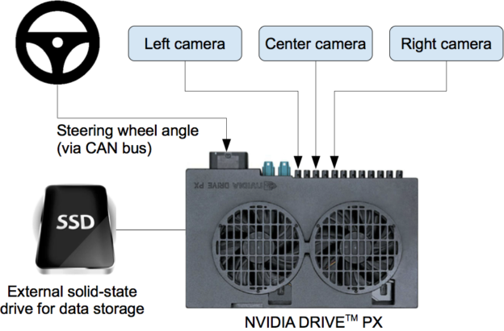
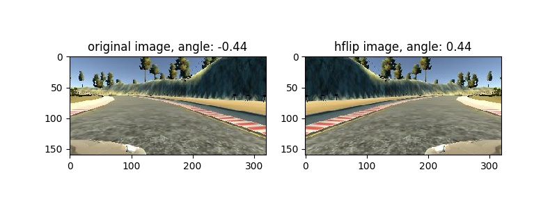
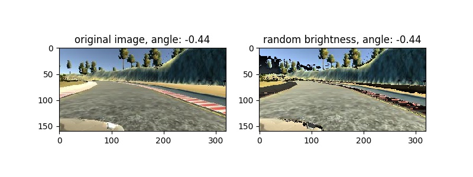
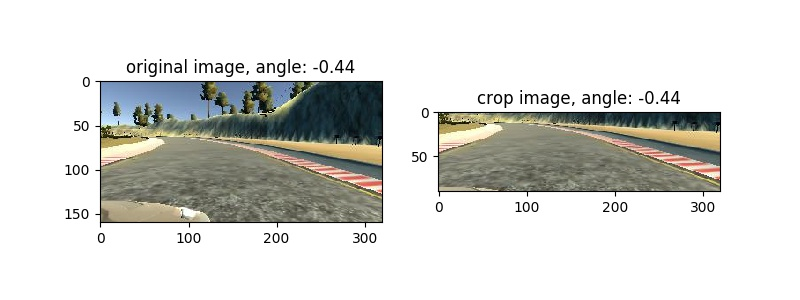
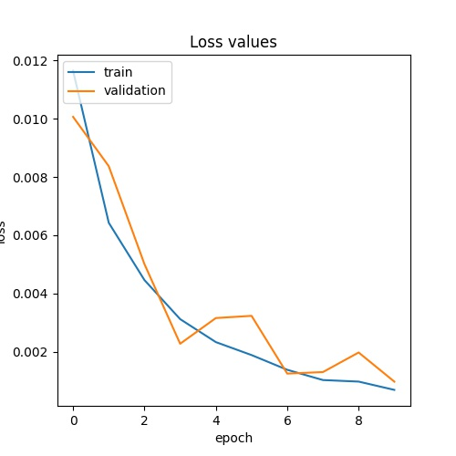

# **Behavioral Cloning Project**

The steps of this project are the following:
* Use the simulator to collect data of good driving behavior
* Build a convolution neural network in Keras that predicts steering angles from images
* Train and validate the model with a training and validation set
* Test that the model successfully drives around track one without leaving the road
* Summarize the results with a written report

(I check the [rubric points](https://review.udacity.com/#!/rubrics/432/view))

---

## Source code structure
My project includes the following files:
* data_utils.py containing the script to load data information and create data generators for training and validation set
* transformation.py for augmentation dataset 
* model.py containing the script to create and train the model
* drive.py for driving the car in autonomous mode
* model.h5 containing a trained convolution neural network
* README.md summarizing the results

## Dataset
### Data collection
I collected data with udacity self-driving car simulator (downloaded Simulator Term 1 [ here](https://github.com/udacity/self-driving-car-sim)). 
The Udacity simulator has two modes, training and autonomous, and two tracks. 
Training mode is to log the data for learning the driving behaviour. 

My strategy for data collection:
- Three laps of center lane driving
- Two laps of recovery driving from the sides
- One lap focusing on driving smoothly around curves

The simulator car had 3 front cameras that are the left camera, the right camera, and the center camera.
I collected and used all images from the three cameras to train and validate my model.

The setup of cameras and steering control were described in the below figure:




### Data Pre-process & Augmentation
First, I applied random horizontal flip and random brightness to the original image. <br>

Random horizontal flip:



Random brightness:



Second, I cropped the original image to remove the head of the car and the scence that is too far from the car.

 
Third, I normalized images to a range of -0.5 to 0.5 (line #27 in the `model.py`)

I tried to resize images to a size of (66, 200, 3) and convert the RGB images to YUV spaces as mentioned in the papers.
However, results were not good, so I decided to not apply the resizing and converting steps.

## Model Architecture
My model bases on [Nvidia model](https://images.nvidia.com/content/tegra/automotive/images/2016/solutions/pdf/end-to-end-dl-using-px.pdf).
It consists of 9 layers, including a normalization layer, 5 convolutional layers, and 4 fully connected layers (model.py lines 18-43).
I tried to applied Dropout layers before Fully connected layers, but results are not good. 

Model architecture:


## Training Strategy
- I randomly shuffled the data set and separated the collected data into two parts: 80% for training, 20% for validation (line #67 in `model.py`).
- The model used an adam optimizer, the learning rate was set to 0.001 (model.py line 25). 
- The batch size is 64.
- I trained the model with 10 epochs.

The progress of training as below:


## How to run
Using the Udacity provided simulator and my drive.py file, the car can be driven autonomously around the track by executing 
```sh
python drive.py model.h5
```

Optionally, the speed of the car could be changed in line #50 in `drive.py` file. By default, the speed was set to 9 MPH.

**Demostration:**

The full demostration is at [https://youtu.be/0fgVSD8TWUc](https://youtu.be/0fgVSD8TWUc)

